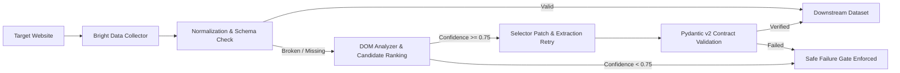

# ScrapeVerse

> **Autonomous Self-Healing Web Scraping Orchestration Platform**
> Maintained data extraction reliability when target website DOM structures mutate.

ScrapeVerse couples external data collection infrastructure (**Bright Data Scraper Studio**) with an automated resilience orchestration layer: telemetry monitoring, dynamic DOM analysis, candidate selector ranking, bounded retries, schema contract validation, and real-time audit reporting.

---

## 1. The Problem: Static Selectors Fail
Traditional web scrapers rely on hardcoded CSS selectors and rigid DOM assumptions. When websites redesign layouts, rename classes, or re-nest elements, scrapers fail silently or crash pipelines, leading to data loss and costly manual repair cycles.

---

## 2. The Solution: Autonomous Resilience Cycle
ScrapeVerse monitors extraction health, detects failures, inspects mutated DOM trees, derives semantic replacement candidates, enforces a confidence safety gate ($\ge 0.75$), re-extracts records, and verifies Pydantic schema contracts before delivering datasets downstream.



---

## 3. Real Production vs. Controlled Simulation

| Dimension | Live Production Mode | Controlled Demo Mode |
|---|---|---|
| **Data Collector** | Live Bright Data Scraper Studio (`c_mt3d61eq4viqmv3f4`) | Local Mock E-Commerce Catalog (`mock-site/index.html`) |
| **DOM Acquisition** | Real-time fetch via Bright Data Web Unlocker / Direct HTTP | Local HTML testbed |
| **Analysis & Ranking** | Dynamic semantic DOM heuristic scoring ($\ge 0.75$) | Evaluates candidate heuristics against mutated DOM |
| **Selector Discovery** | Discovers `h3 a`, `.price_color`, `.instock.availability` dynamically | Deterministic rule mutation for test verification |
| **Validation** | Strict Pydantic v2 `ProductRecord` contract verification | Strict Pydantic v2 `ProductRecord` contract verification |
| **Purpose** | **Genuine real-world pipeline extraction & recovery** | **Deterministic fault injection for repeatable demos** |

---

## 4. "Repaired" vs. "Verified" Contract

> [!IMPORTANT]
> **A selector repair is NOT considered successful until the recovered dataset passes validation.**
> 1. **Repaired**: A candidate selector hypothesis was discovered from the DOM with $\ge 0.75$ confidence score.
> 2. **Verified**: The scraper re-executed against the target DOM using the candidate selector, extracted records, and passed 100% of Pydantic schema validation rules (`ProductRecord`).

---

## 5. Evidence-Based Safety Gate & Safe Failure

ScrapeVerse **does not claim universal recovery**. If DOM evidence is ambiguous, contradictory, or below the $0.75$ confidence threshold, the engine **halts automatically** with a structured `SAFE_FAILURE` state to prevent corrupt or hallucinated data ingestion.

- **`recoverable`**: High-confidence candidates ($\ge 0.75$) validated with passing schema contract.
- **`partially_recoverable`**: Subset of broken fields recovered; invalid fields flagged.
- **`ambiguous_unsafe`**: Candidate confidence $< 0.75$ — extraction safely aborted.
- **`unsupported`**: Non-conforming DOM structure (e.g. canvas, WebSockets, or non-catalog layout).

---

## 6. Judge Demo Flow

### Stage A: Live Extraction (Healthy Baseline)
1. Target URL: `https://books.toscrape.com/catalogue/category/books/travel_2/index.html`
2. Click **"Run Scraper (Live)"**.
3. Scrapes live records via Bright Data Scraper Studio collector `c_mt3d61eq4viqmv3f4`.
4. Returns **11 valid records**, normalized into strict `ProductRecord` contracts with **100% Quality Score**.

### Stage B: Controlled Failure & Autonomous Recovery
1. Click **"Simulate Failure (Controlled Demo)"** to mutate active extraction rules.
2. Click **"Run Scraper (Live)"** $\rightarrow$ Scraper fails deterministically ($0$ records, `SelectorNotFound`).
3. Click **"Self-Healing Recovery"**:
   - Dynamic DOM analysis scores and ranks candidate elements.
   - Synthesizes verified replacement rules (`h3 a`, `.price_color`, `.instock.availability`).
   - Re-extracts and verifies all **11 product records**.
   - Audit summary displays Before ($0$) $\rightarrow$ Healing ($98\%$ Conf) $\rightarrow$ After ($11$ Records Verified).
4. Subsequent **"Run Scraper"** executions operate normally with the healed runtime configuration.

### Stage C: Local Mock Catalog (Offline Backup)
If internet connectivity is unavailable, switch to `SCRAPER_MODE=mock` to demonstrate the exact same self-healing pipeline across 42 local e-commerce products without tokens or external network dependencies.

---

## 7. Known Limitations & Technical Boundaries

ScrapeVerse is engineered with honest architectural boundaries:
- **Canvas / WebGL / Shadow DOM**: Elements rendered purely on HTML5 Canvas or encapsulated within closed Shadow DOMs cannot be resolved by standard CSS tree traversal.
- **Authentication & Paywalls**: Pages requiring multi-step OAuth, CAPTCHAs, or session cookies require upstream proxy unlocker bypass.
- **Insufficient Semantic Context**: Obfuscated single-letter class names without structural headings or text proximity trigger the `SAFE_FAILURE` gate.
- **Non-Standard Catalogs**: Deeply nested infinite-scroll layouts requiring custom JavaScript scroll handlers.

---

## 8. API Reference

| Method | Endpoint | Description |
|---|---|---|
| `GET` | `/` | Service health and engine metadata |
| `GET` | `/api/scrape` | Execute active scraper pipeline (`?url=...`, `?fail=true`) |
| `GET` | `/api/healing/status` | System health, collector mode, and safety gate threshold |
| `POST` | `/api/healing/recover` | Execute autonomous self-healing recovery against target DOM |
| `POST` | `/api/healing/simulate-failure` | Activate controlled failure state for demo testing |
| `POST` | `/api/healing/reset` | Reset extraction configuration back to healthy baseline |
| `POST` | `/api/healing/multi-demo` | Multi-field catalog self-healing testbed |

---

## 9. Security Note: Token Isolation

> [!CAUTION]
> `BRIGHTDATA_API_TOKEN` is loaded strictly through environment configuration (`.env`). It is masked in all application logs (`c748...f0f8`), excluded from API response payloads, and never committed to source control.

---

## 10. Quickstart & Local Setup

### Prerequisites
- Python 3.11+
- Node.js 18+ and npm

### 1. Backend Setup
```bash
# Clone repository
git clone https://github.com/NitishAwesome/Scrape-Verse-IndiScrapers.git
cd Scrape-Verse-IndiScrapers

# Install dependencies
pip install -r requirements.txt

# Start FastAPI backend (port 8000)
uvicorn backend.main:app --host 0.0.0.0 --port 8000 --reload
```

### 2. Frontend Dashboard Setup
```bash
# In a separate terminal:
cd frontend
npm install
npm run dev
```
Open `http://localhost:5173` in your browser.

---

## 11. Automated Test Suite

Run the full pytest test suite covering unseen DOMs, partial repairs, safe failures, token masking, and demo lifecycle:

```bash
python -m pytest -v
```

**Test Results**: `74 passed, 1 skipped in 25s` (100% pass rate).
